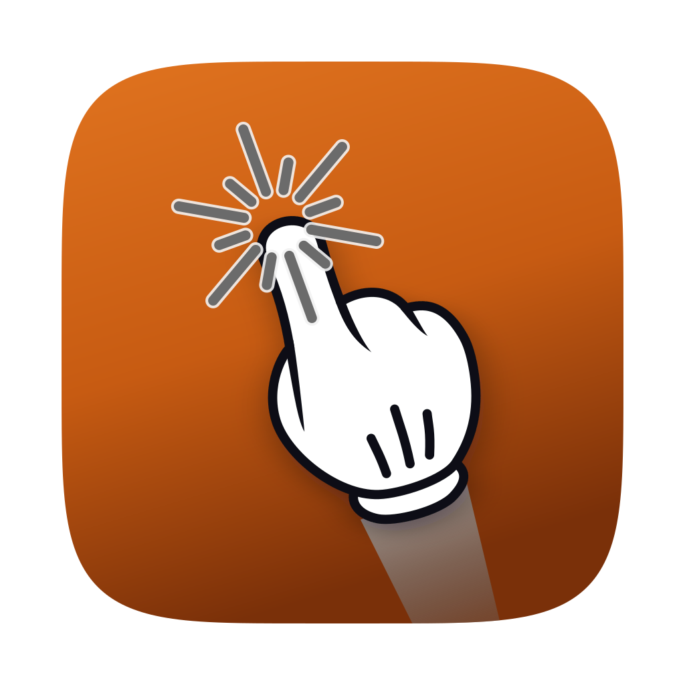

<div align="center">



# Quiet Pointer

**A big friendly hand for your cursor. Poke included.**

A native macOS menu bar app that replaces the system cursor on demand with a large, highly visible hand pointer — perfect for screen shares, recordings, and live demos. Click, and the hand pokes. Part of the [Quiet Apps](https://github.com/quietapps) family.

[](https://www.apple.com/macos/)
[](https://swift.org)
[](https://developer.apple.com/xcode/swiftui/)
[](LICENSE)
[](https://github.com/quietapps/QuietPointer/releases)
[](https://github.com/quietapps/QuietPointer/releases)
[](https://github.com/quietapps/QuietPointer/stargazers)

[Install](#install) · [Features](#features) · [Usage](#usage) · [Build from source](#build-from-source) · [FAQ](#faq)

</div>

---

## Why

You're presenting. You say "click here" — and half the room can't find your tiny arrow on a 4K screen.

Quiet Pointer lives in your menu bar. One hotkey (`⌃⌥P`) swaps the system cursor for a big cartoon hand that everyone can follow. Click, and the hand does a satisfying poke — click faster and the pokes get wilder. Only the cursor's *appearance* changes: clicking, dragging, selecting, and navigating all work exactly as before. No cloud. No account. No telemetry.

## Features

**Current release:** version **1.0.0**, build **1** — see [CHANGELOG](CHANGELOG.md) for per-build notes

### The hand

- **System-wide cursor replacement** — a cartoon hand pointer (white glove, index up-left, thumb up) atop a long fading shadow rod floats above every app and follows the mouse pixel-for-pixel; the fingertip is the hotspot
- **Replaces the real arrow** — while enabled, the macOS cursor is hidden (`CGDisplayHideCursor`) and the hand stands in; toggling off restores the arrow instantly
- **Vector-drawn in code** — stays crisp at any size and display scale, no bundled images
- **Multi-monitor** — one overlay per display, rebuilt automatically when displays change; the hand crosses screens seamlessly

### The poke

- **Click "poke" animation** — a single click just moves the pointer; rapid repeat clicks fire a comic burst at the fingertip that cycles through four styles (sparkle → spikes → jagged ring → double-sparkle) and grows with the click count
- **Four expressiveness modes** — *Shy finger → Gentle nudge → Bold poke → In your face* — each with its own jab distance, scale, speed, and wobble
- **Speed-reactive intensity** — rapid clicks ramp the poke up to 3× the base animation
- **Works everywhere** — clicks are caught with global `NSEvent` monitors, so pokes fire no matter which app is focused

### Customization

- **Glove color** — Classic white, Orange, Red, Green, Blue, Purple, Yellow
- **Shadow length** — slider from short to long
- **Expressiveness slider** — right in the menu bar menu, no need to open Preferences
- **Global hotkey** — default `⌃⌥P`, remappable in Preferences; works even when Quiet Pointer isn't focused

### Native macOS feel

- Menu bar agent — no Dock icon (`LSUIElement` + `.accessory` policy)
- 100% Swift — SwiftUI Preferences + AppKit overlay
- No external dependencies — Apple frameworks only
- **No permissions required** — no Accessibility, no Input Monitoring, no network

## Install

> **Note:** Quiet Pointer is not code-signed with an Apple Developer ID. macOS Gatekeeper will warn on first launch. The steps below work around it automatically.

### Homebrew (recommended)

```bash
brew tap quietapps/quietpointer
brew install --cask quietpointer
```

The cask strips the macOS quarantine attribute on install so Gatekeeper does not block launch. The tap is at [quietapps/homebrew-quietpointer](https://github.com/quietapps/homebrew-quietpointer).

### Direct download

1. Grab the latest `QuietPointer-*.zip` from [Releases](https://github.com/quietapps/QuietPointer/releases/latest)
2. Unzip → drag **Quiet Pointer.app** into `/Applications`
3. Strip the quarantine attribute (or right-click → Open once):

```bash
xattr -cr "/Applications/Quiet Pointer.app"
```

4. Launch Quiet Pointer — the hand icon appears in your menu bar
5. Click it (or press `⌃⌥P`) and the hand takes over your cursor

### If the app doesn't open (Gatekeeper blocked it)

macOS silently blocks unsigned binaries on first launch. Fix it once with any of these:

**Option A — Right-click open (no Terminal needed)**
1. Open Finder → `/Applications`
2. Right-click **Quiet Pointer.app** → **Open**
3. Click **Open** in the warning dialog
4. macOS remembers your choice for every future launch

**Option B — Terminal**
```bash
xattr -cr "/Applications/Quiet Pointer.app"
```

**Option C — System Settings**
1. Try to launch the app — macOS shows a blocked notification
2. Open **System Settings → Privacy & Security**
3. Scroll to the message about Quiet Pointer
4. Click **Open Anyway**

## Updating

### Homebrew

```bash
brew update
brew upgrade --cask quietpointer
```

### Direct download

Download the newer zip from [Releases](https://github.com/quietapps/QuietPointer/releases), drag the new **Quiet Pointer.app** over the old one in `/Applications`, then run:

```bash
xattr -cr "/Applications/Quiet Pointer.app"
```

Your preferences are stored separately and are unaffected by app updates.

## Uninstalling

### Homebrew

```bash
# Remove the app and its preferences (via the cask's zap stanza)
brew uninstall --cask --zap quietpointer

# Drop the tap
brew untap quietapps/quietpointer

# Purge Homebrew's download cache
brew cleanup --prune=all -s
```

Optional manual cleanup if you skipped `--zap`:

```bash
defaults delete app.quiet.QuietPointer 2>/dev/null
rm -rf ~/Library/Preferences/app.quiet.QuietPointer.plist \
       ~/Library/Caches/app.quiet.QuietPointer \
       ~/Library/Saved\ Application\ State/app.quiet.QuietPointer.savedState
```

### Direct download

```bash
# Move the app to Trash
rm -rf "/Applications/Quiet Pointer.app"

# Remove preferences
defaults delete app.quiet.QuietPointer 2>/dev/null
rm -rf ~/Library/Preferences/app.quiet.QuietPointer.plist \
       ~/Library/Caches/app.quiet.QuietPointer \
       ~/Library/Saved\ Application\ State/app.quiet.QuietPointer.savedState
```

## Usage

| Action | How |
|---|---|
| Show / hide the hand | Click the menu bar icon → **Show hand**, or press `⌃⌥P` |
| Poke | Click anything — rapid clicks poke harder |
| Set expressiveness | Menu bar → drag the **Shy finger ⟷ In your face** slider |
| Change glove color | Menu bar → **Pointer color** |
| Adjust shadow length | Menu bar slider, or Preferences → Appearance |
| Toggle click animation | Menu bar → **Animate on click** |
| Remap the hotkey | Menu bar → **Preferences…** → Global Hotkey → press new keys |
| Check for updates | Menu bar → **Check for Updates…** |
| Quit | Menu bar → **Quit** |

### Screen capture

Quiet Pointer is a real overlay drawn on top of the whole screen, so it appears in **full-screen** captures and recordings — share *Entire Screen* in Zoom/Meet, full-display capture in OBS/Loom/QuickTime.

It will **not** appear when you share a **single application window**: macOS composites single-window capture from that window's own content only and excludes everything drawn outside it — including the overlay and the real system cursor. Share the whole screen to show the hand.

## Permissions

None. Quiet Pointer needs **no Accessibility, no Input Monitoring, and no network access**.

- The global hotkey uses Carbon's `RegisterEventHotKey`, which works without Accessibility
- Mouse tracking and click detection use global `NSEvent` monitors for mouse events, which macOS allows without special permission
- Zero network calls — no analytics, no telemetry

## How it works

| Requirement | Implementation |
|---|---|
| Cursor replacement | One borderless, transparent, click-through `NSWindow` per display, above the shielding-window level, draws the hand and hides the real cursor with `CGDisplayHideCursor` |
| Follows the mouse | Global + local `NSEvent` monitors move the hand to the display under the cursor and pin the fingertip to `NSEvent.mouseLocation` on every move/drag |
| Click poke | Mouse-down monitors trigger a `CAKeyframeAnimation` jab (translate + scale + wobble) anchored at the fingertip, plus a `CAShapeLayer` starburst |
| Speed reactivity | `ClickMonitor` keeps a sliding window of recent click timestamps and scales the animation up to 3× |
| Global hotkey | Carbon `RegisterEventHotKey` — works unfocused, no Accessibility permission needed |
| Multi-monitor | One overlay per `NSScreen`; the set is rebuilt on `didChangeScreenParameters` |
| No Dock icon | `LSUIElement` + `.accessory` activation policy |

The hand itself is **vector-drawn in code** (`HandCursorRenderer`), so it stays crisp at any size and display scale and ships no bundled image.

## Build from source

### Requirements

- macOS 26.0 (Tahoe) or later
- Xcode 26.0 or later

No paid Apple Developer account required — the project uses automatic signing with any personal team.

### Steps

```bash
git clone https://github.com/quietapps/QuietPointer.git
cd QuietPointer
open QuietPointer.xcodeproj
```

Press **⌘R** in Xcode. The hand icon appears in your menu bar.

Or from the command line:

```bash
xcodebuild -project QuietPointer.xcodeproj -scheme QuietPointer -configuration Release build
```

### Project layout

```
QuietPointer/
├── main.swift                     # Accessory app bootstrap (no dock icon)
├── AppDelegate.swift              # Status item, menu, hotkey wiring
├── Info.plist                     # LSUIElement, bundle config
├── QuietPointer.entitlements
├── Managers/
│   ├── CursorManager.swift        # Overlay lifecycle, mouse tracking, hide/show
│   ├── HotKeyManager.swift        # Carbon global hotkey
│   └── ClickMonitor.swift         # Click-cadence → intensity
├── Models/
│   ├── PokeMode.swift             # The four expressiveness modes
│   ├── Preferences.swift          # UserDefaults-backed settings
│   └── KeyCodeNames.swift         # Key-code → display string
├── Cursor/
│   ├── HandCursorRenderer.swift   # Vector hand drawing
│   ├── HandCursorView.swift       # Hand layer + poke animation
│   └── CursorOverlayWindow.swift  # Transparent all-display overlay
└── Views/
    ├── PreferencesView.swift      # SwiftUI preferences + hotkey recorder
    └── PreferencesWindowController.swift
```

No external dependencies — Apple frameworks only (AppKit, SwiftUI, Carbon hotkeys, CoreAnimation).

## Configuration

All settings are in **Preferences** (menu bar icon → **Preferences…**). Reset to defaults:

```bash
defaults delete app.quiet.QuietPointer
```

## FAQ

**Does Quiet Pointer send any data anywhere?**
No. Zero network calls. No analytics, no telemetry.

**Does it change how clicking works?**
No. Only the cursor's appearance changes. Clicking, dragging, selecting, and navigating all behave exactly as before — the overlay is fully click-through.

**Why doesn't the hand show up in my Zoom share?**
You're sharing a single window. macOS excludes everything drawn outside that window from single-window capture — including the overlay and the real cursor. Share your entire screen instead.

**Does it need Accessibility permission?**
No. The hotkey uses Carbon's `RegisterEventHotKey` and mouse tracking uses global `NSEvent` monitors — neither requires Accessibility or Input Monitoring.

**Does it work with multiple displays?**
Yes. One overlay per display, rebuilt automatically when you plug or unplug monitors. The hand crosses screens seamlessly.

**The poke is too much (or not enough).**
Drag the **Shy finger ⟷ In your face** slider in the menu bar menu, or pick a mode in Preferences. You can also disable **Animate on click** entirely.

**Does it slow my Mac down?**
No. The overlay redraws only on mouse movement and clicks. CPU stays negligible when the hand is idle, and zero when it's hidden.

**How do I quit?**
Click the menu bar icon → **Quit**.

## Credits

Interaction design inspired by [Pokey](https://pokeyapp.com). All code and art here are independent and original — no Pokey assets are used.

The glove pointer is derived from *"MultiTouch-Interface Mouse-theme 1-finger"* by **BenBois** on [openclipart.org](https://openclipart.org/detail/160435/), released into the **public domain**. Its SVG path data is parsed and re-rendered by `HandCursorRenderer`.

## License

[MIT](LICENSE) © Quiet Apps

---

<div align="center">
If Quiet Pointer makes your demos easier to follow, drop a ⭐ on the repo.
</div>
